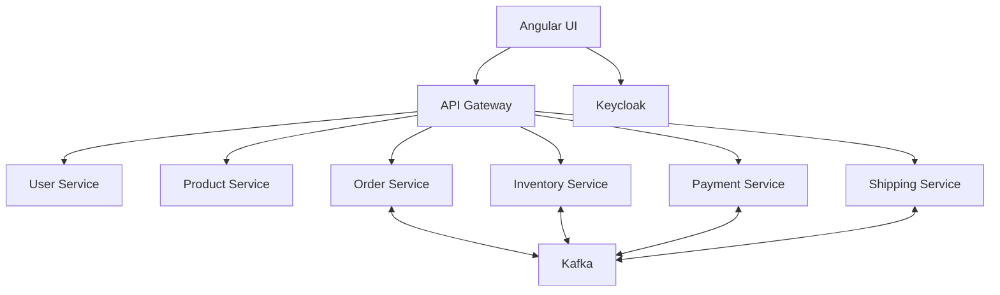

# Karan Commerce — E-Commerce Microservices Application

Karan Commerce is a complete learning and portfolio project that demonstrates how an e-commerce application can be built using independent Spring Boot microservices, Kafka events, Keycloak authentication, an API Gateway, and an Angular frontend.

The application supports:

- Public product browsing and shipment tracking
- Customer registration and Keycloak login
- Customer profiles, carts, checkout, orders, payments, and shipments
- Administrator management of categories, products, inventory, users, orders, payments, and shipping
- Event-driven inventory, payment, order, and shipment processing through Kafka
- A single API entry point through Spring Cloud Gateway
- Correlation IDs for tracing requests across the Gateway

> This repository is designed as a local development and demonstration project. Read the [Production and deployment notes](#production-and-deployment-notes) before exposing it publicly.

## Table of contents

1. [Architecture](#architecture)
2. [Services and ports](#services-and-ports)
3. [Technology stack](#technology-stack)
4. [Repository structure](#repository-structure)
5. [Prerequisites](#prerequisites)
6. [First-time installation](#first-time-installation)
7. [Keycloak configuration](#keycloak-configuration)
8. [Starting the application](#starting-the-application)
9. [Opening and using the UI](#opening-and-using-the-ui)
10. [End-to-end UI test](#end-to-end-ui-test)
11. [API Gateway checks](#api-gateway-checks)
12. [Running the Angular UI locally](#running-the-angular-ui-locally)
13. [Useful Docker commands](#useful-docker-commands)
14. [Data persistence](#data-persistence)
15. [Troubleshooting](#troubleshooting)
16. [Git workflow](#git-workflow)
17. [Production and deployment notes](#production-and-deployment-notes)

## Architecture



### How a customer order moves through the system

1. The customer signs in through Keycloak.
2. The Angular UI sends API calls to the API Gateway.
3. The Gateway validates the access token and routes the request to the correct service.
4. Order Service creates the order with inventory and payment initially pending.
5. Inventory Service consumes the order event and reserves stock.
6. Payment Service creates a demo Google Pay payment attempt.
7. An administrator completes the demo payment from the Operations UI.
8. When both stock and payment succeed, Order Service confirms the order.
9. Shipping Service creates a shipment.
10. An administrator assigns tracking and moves the shipment to delivered.

## Services and ports

| Component | Docker service name | Host port | Purpose |
| --- | --- | ---: | --- |
| Keycloak | `keycloak` | `8080` | Authentication, users, and roles |
| User Service | `user-service` | `8081` | Customer profiles and user administration |
| Product Service | `product-service` | `8082` | Categories, products, and catalog |
| Order Service | `order-service` | `8083` | Orders and order state |
| Inventory Service | `inventory-service` | `8084` | Stock, reservations, and inventory ledger |
| Payment Service | `payment-service` | `8085` | Demo payment attempts and refunds |
| Shipping Service | `shipping-service` | `8086` | Shipments, tracking, and delivery history |
| API Gateway | `api-gateway` | `8087` | Single API entry point, security, routing, and correlation IDs |
| Angular UI | `ui-service` | `4200` | Storefront, customer account, and admin console |
| Kafka | `kafka` | `9092` | Event communication between services |

Important URLs:

- Storefront: <http://localhost:4200>
- Keycloak: <http://localhost:8080>
- API Gateway: <http://localhost:8087>
- Gateway health: <http://localhost:8087/actuator/health>

## Technology stack

### Backend

- Java 17
- Spring Boot
- Spring Security OAuth 2 Resource Server
- Spring Cloud Gateway WebFlux
- Spring Data JPA
- Apache Kafka
- Flyway database migrations
- H2 file databases for local development
- Maven Wrapper

### Frontend

- Angular 21
- TypeScript
- RxJS
- Keycloak JavaScript adapter
- Nginx for the production container
- Vitest for UI unit tests

### Infrastructure

- Docker Desktop
- Docker Compose
- Keycloak 26
- Apache Kafka

## Repository structure

```text
E-Commerce-Application/
├── api_gateway/              Spring Cloud API Gateway
├── ui_service/               Angular storefront and admin console
├── user_service/             Customer profile service
├── product_service/          Category and product service
├── order_service/            Order service
├── inventory_service/        Inventory and reservation service
├── payment_service/          Demo payment service
├── shipping_service/         Shipment and tracking service
├── testing/                  Postman collection and environment
├── docker-compose.yml        Runs the complete local application
├── UI_AND_GATEWAY_TESTING_GUIDE.md
└── README.md
```

Folder names use underscores, while Docker service names use hyphens. For example:

```text
Folder: product_service
Docker service: product-service
```

## Prerequisites

Install the following before starting:

1. **Git** — used to clone the repository.
2. **Docker Desktop** — used to build and run the complete application.
3. **Java 17** — required when running or testing Spring services outside Docker.
4. **Node.js 24 LTS and npm** — required only when running the Angular UI outside Docker.
5. **Postman** — optional, for API testing.

Verify the main tools:

```bash
git --version
docker version
docker compose version
java -version
node --version
npm --version
```

Use an even-numbered Node.js LTS release. Avoid odd-numbered releases such as Node.js 25 for production work.

## First-time installation

### 1. Clone the repository

```bash
git clone https://github.com/karanjainkj021201/E-Commerce-Application.git
cd E-Commerce-Application
```

All commands in this README assume the terminal is currently inside the root `E-Commerce-Application` directory.

### 2. Start Docker Desktop

Open Docker Desktop and wait until it reports that the Docker Engine is running.

Verify connectivity:

```bash
docker version
```

The command must show both a Client and Server section.

### 3. Validate Docker Compose

```bash
docker compose config >/dev/null
```

No output means the Compose YAML is valid.

### 4. Build the images

```bash
docker compose build
```

The first build downloads Java, Maven, Node.js, Nginx, Kafka, and Keycloak images, so it can take several minutes.

### 5. Start the containers

```bash
docker compose --parallel 1 up -d
```

`--parallel 1` asks Docker Compose to perform engine operations serially. It is useful on systems where recreating several dependent services concurrently causes a `concurrent map writes` Compose crash.

### 6. Check container status

```bash
docker compose ps -a
```

The expected containers are:

```text
keycloak
kafka
user-service
product-service
order-service
inventory-service
payment-service
shipping-service
api-gateway
ui-service
```

Spring Boot services may require 30–60 seconds after the container starts before their APIs are ready.

## Keycloak configuration

Keycloak requires a one-time local setup after its data volume is created.

### 1. Open the administration console

Open <http://localhost:8080> and select **Administration Console**.

For the local Docker configuration, the initial administrator is:

```text
Username: admin
Password: admin
```

These credentials are for local development only. Never use them for a public deployment.

### 2. Create the realm

1. Open the realm selector in the top-left.
2. Select **Create realm**.
3. Enter:

```text
Realm name: ecommerce
```

4. Select **Create**.

Realm names are case-sensitive. Use lowercase `ecommerce`.

### 3. Create the Angular client

1. Open **Clients**.
2. Select **Create client**.
3. Choose **OpenID Connect**.
4. Enter:

```text
Client ID: ecommerce-ui
```

5. Keep **Client authentication** disabled because this is a browser application.
6. Enable the standard authorization-code flow.
7. Save the client.

Configure these client URLs:

```text
Root URL: http://localhost:4200
Home URL: http://localhost:4200
Valid redirect URIs: http://localhost:4200/*
Valid post logout redirect URIs: http://localhost:4200/*
Web origins: http://localhost:4200
```

### 4. Create roles

Open **Realm roles** and create:

```text
ADMIN
CUSTOMER
```

Role names are case-sensitive. The application expects uppercase `ADMIN` for the Operations console.

### 5. Create an administrator user

1. Open **Users** and select **Create new user**.
2. Create a user such as `karanadmin`.
3. Add a valid email and first name.
4. Open **Credentials** and set a permanent password.
5. Open **Role mapping** and assign the `ADMIN` role.

### 6. Create a customer user

Repeat the process for a separate customer account and assign the `CUSTOMER` role.

Do not use the administrator account for the customer-only authorization test.

### 7. Verify the browser-facing issuer

```bash
curl -s http://localhost:8080/realms/ecommerce/.well-known/openid-configuration \
  | python3 -m json.tool \
  | grep -E '"issuer"|"authorization_endpoint"'
```

Expected issuer:

```text
http://localhost:8080/realms/ecommerce
```

The browser-visible token issuer is `localhost`, while Docker services download signing keys through the internal hostname `keycloak`.

## Starting the application

For later sessions, start Docker Desktop and run:

```bash
cd ~/Desktop/E-Commerce-Application
docker compose --parallel 1 up -d
docker compose ps
```

If the project was cloned somewhere else, use that directory instead of `~/Desktop/E-Commerce-Application`.

To stop the application without deleting data:

```bash
docker compose stop
```

To start stopped containers again:

```bash
docker compose start
```

## Opening and using the UI

Open:

```text
http://localhost:4200
```

Public features:

- View products and categories
- Search by name or SKU
- Filter by category
- View inventory availability
- Track a shipment

Authenticated customer features:

- Create or update a User Service profile
- Add products to the cart
- Checkout using the Google Pay demo method
- View orders, payments, and shipments
- Cancel an eligible order

Administrator features:

- Create and activate categories and products
- Create and adjust warehouse stock
- View all orders
- Complete or fail demo payments
- Request refunds
- Assign carriers and tracking numbers
- Update shipment status
- View customer profiles and update their status

## End-to-end UI test

Use two different browser contexts so Keycloak sessions do not get mixed:

- Normal browser window: administrator
- Incognito window: customer

### Phase A — Administrator prepares the catalog

1. Sign in with the administrator account.
2. Confirm **Operations** appears in the navigation bar.
3. Open **Operations → Catalog**.
4. Create a category:

```text
Name: UI Test Products
Code: UI_TEST_PRODUCTS
Description: Products used for end-to-end testing
```

5. Create a product:

```text
SKU: UI-PRODUCT-001
Name: UI Test Product
Price: 100
Currency: INR
Category: UI Test Products
Description: Product used for checkout testing
```

6. Change the product status to `ACTIVE` and select **Save**.
7. Select **Add stock**.
8. Create the stock balance:

```text
Warehouse: WH-DEFAULT
Initial quantity: 25
Reason: Initial UI stock
```

9. Return to **Shop** and confirm that the product is visible.

If the stock combination already exists, do not create it again. Select **Refresh all services** and use the existing record.

### Phase B — Customer places an order

1. Sign out and sign in using the customer account.
2. Confirm **Operations** is not visible.
3. Open **My account → Profile**.
4. Save a name, email, and phone number.
5. Open **Shop** and add `UI Test Product` to the cart.
6. Verify the cart:

```text
Product: ₹100
Shipping: ₹50
Estimated total: ₹150
```

7. Select **Proceed to checkout**.
8. Enter contact and shipping-address details.
9. Confirm `Google Pay demo` is selected.
10. Place the order.

The immediate response normally begins with:

```text
Order: CREATED
Inventory: RESERVATION_PENDING
Payment: PAYMENT_PENDING
```

Kafka processing may quickly change inventory to `RESERVED` and create a payment attempt.

### Phase C — Administrator completes payment and shipping

1. Return to the administrator session.
2. Open **Operations → Payments**.
3. Find the payment for the new order.
4. Select **Mock success** and enter a gateway reference.
5. Open **Operations → Orders** and select **Refresh events**.
6. Confirm the order becomes `CONFIRMED` after both payment and inventory succeed.
7. Open **Operations → Shipping**.
8. Find the automatically created shipment.
9. Assign a carrier and unique tracking number.
10. Update the shipment in this order:

```text
CREATED
IN_TRANSIT
OUT_FOR_DELIVERY
DELIVERED
```

### Phase D — Customer verifies delivery

1. Return to the customer session.
2. Open **My account** and select **Refresh activity**.
3. Confirm the order, payment, and shipment show their final successful states.
4. Open **Track** and enter the assigned tracking number.
5. Confirm the delivery timeline appears.
6. Sign out and confirm public tracking still works without authentication.

## API Gateway checks

### Health

```bash
curl -i http://localhost:8087/actuator/health
```

### Categories

```bash
curl -i http://localhost:8087/api/catalog/categories
```

### Products

```bash
curl -i "http://localhost:8087/api/catalog/products?page=0&size=12"
```

### Product availability

Replace `4` with a real product ID:

```bash
curl -i http://localhost:8087/api/inventory/products/4/availability
```

### Correlation ID generation

```bash
curl -i http://localhost:8087/api/catalog/categories
```

The response should contain a header such as:

```text
X-Correlation-Id: 26ac3cec-99ff-4d66-a17c-e5484efa0e97
```

### Correlation ID preservation

```bash
curl -i \
  -H "X-Correlation-Id: novice-test-001" \
  http://localhost:8087/api/catalog/categories
```

Expected response header:

```text
X-Correlation-Id: novice-test-001
```

## API Gateway routes

The UI calls only the Gateway using the `/api` prefix. The Gateway removes that prefix before routing the request.

| Gateway path | Destination |
| --- | --- |
| `/api/users/**` | User Service |
| `/api/catalog/**` | Product Service |
| `/api/admin/products/**` | Product Service |
| `/api/admin/categories/**` | Product Service |
| `/api/orders/**` | Order Service |
| `/api/admin/orders/**` | Order Service |
| `/api/inventory/**` | Inventory Service |
| `/api/admin/inventory/**` | Inventory Service |
| `/api/payments/**` | Payment Service |
| `/api/admin/payments/**` | Payment Service |
| `/api/shipments/**` | Shipping Service |
| `/api/admin/shipments/**` | Shipping Service |

Public routes include catalog browsing, product availability, Gateway health, and shipment tracking. Other routes require a valid Keycloak access token. Admin routes require the `ADMIN` role.

## Running the Angular UI locally

The Docker UI is recommended for a complete application run. Use local Angular development only when actively editing the frontend.

### 1. Stop the Docker UI to release port 4200

```bash
docker compose stop ui-service
```

### 2. Install dependencies

```bash
cd ui_service
npm ci
```

### 3. Run tests

```bash
npm test
```

### 4. Build the UI

```bash
npm run build
```

### 5. Start the Angular development server

```bash
npm start
```

Open <http://localhost:4200>. The local proxy forwards `/api` requests to the Gateway on port `8087`.

Press `Ctrl+C` to stop the development server.

Return to the repository root and restart the Docker UI when required:

```bash
cd ..
docker compose up -d --no-deps ui-service
```

## Testing individual Java services

Each Java service includes a Maven Wrapper. For example:

```bash
cd api_gateway
./mvnw test
```

On macOS or Linux, make the wrapper executable if necessary:

```bash
chmod +x mvnw
```

Then return to the root directory:

```bash
cd ..
```

## Useful Docker commands

### View status

```bash
docker compose ps -a
```

### View all recent logs

```bash
docker compose logs --tail=100
```

### Follow logs for selected services

```bash
docker compose logs -f api-gateway order-service product-service
```

Press `Ctrl+C` to stop following logs. The containers continue running.

### Rebuild one service after code changes

```bash
docker compose build product-service
docker compose --parallel 1 up -d --force-recreate --no-deps product-service
```

### Rebuild the Angular UI

```bash
docker compose build ui-service
docker compose --parallel 1 up -d --force-recreate --no-deps ui-service
```

### Restart a service without rebuilding

```bash
docker compose restart api-gateway
```

### Stop everything without deleting data

```bash
docker compose stop
```

## Data persistence

Docker volumes store Keycloak, Kafka, and service data:

```text
keycloak_data
kafka_data
user_data
product_data
order_data
inventory_data
payment_data
shipping-data
```

Rebuilding or recreating a container does not normally delete its volume data.

### Important warning

Do not run this command unless you deliberately want to delete all local application data:

```bash
docker compose down -v
```

The `-v` flag deletes Docker volumes, including the Keycloak realm, users, products, orders, and other saved data.

## Environment variables

The Compose file configures the services for Docker networking.

| Variable | Meaning |
| --- | --- |
| `SPRING_PROFILES_ACTIVE=docker` | Loads each service's Docker configuration |
| `SPRING_SECURITY_OAUTH2_RESOURCESERVER_JWT_ISSUER_URI` | Issuer value that must match the token |
| `SPRING_SECURITY_OAUTH2_RESOURCESERVER_JWT_JWK_SET_URI` | Internal URL used to download Keycloak signing keys |
| `JWT_ISSUER_URI` | API Gateway token issuer |
| `JWT_JWK_SET_URI` | API Gateway signing-key URL |
| `KAFKA_BOOTSTRAP_SERVERS` | Kafka broker address |
| `PRODUCT_SERVICE_URL` | Product Service address used by the Gateway |
| `ORDER_SERVICE_URL` | Order Service address used by the Gateway |
| `UI_ORIGIN` | Browser origin allowed by Gateway CORS |

The correct local Docker pattern is:

```text
Issuer: http://localhost:8080/realms/ecommerce
JWK URL: http://keycloak:8080/realms/ecommerce/protocol/openid-connect/certs
```

`localhost` is written into browser-issued tokens. `keycloak` is resolvable between Docker containers.

## Troubleshooting

### Docker says `no such service: api-gateway`

Confirm that you are in the root directory and that Compose knows the service:

```bash
cd ~/Desktop/E-Commerce-Application
docker compose config --services
```

The list must contain `api-gateway`.

### Docker Compose crashes with `fatal error: concurrent map writes`

Limit Compose parallelism:

```bash
docker compose --parallel 1 up -d --force-recreate --no-deps \
  user-service \
  product-service \
  order-service \
  inventory-service \
  payment-service \
  shipping-service \
  api-gateway
```

### Port 8087 is already in use

```bash
lsof -nP -iTCP:8087 -sTCP:LISTEN
```

Stop the old local Java process or the old container before starting the Gateway again.

### Keycloak displays `Cookie not found`

Verify the active command:

```bash
docker inspect keycloak --format '{{json .Config.Cmd}}'
```

Expected:

```text
["start-dev","--hostname=http://localhost:8080","--hostname-backchannel-dynamic=true"]
```

After correcting Compose, recreate Keycloak without deleting its volume:

```bash
docker compose up -d --force-recreate --no-deps keycloak
```

Close old Keycloak tabs and retry from a fresh Incognito window.

### Catalog works with curl but fails after login

Authenticated UI requests include a bearer token. Confirm every backend has these environment variables:

```text
SPRING_SECURITY_OAUTH2_RESOURCESERVER_JWT_ISSUER_URI=http://localhost:8080/realms/ecommerce
SPRING_SECURITY_OAUTH2_RESOURCESERVER_JWT_JWK_SET_URI=http://keycloak:8080/realms/ecommerce/protocol/openid-connect/certs
```

The UI interceptor intentionally avoids adding tokens to public catalog, availability, and tracking requests.

### Inventory says the product/warehouse combination already exists

Stock is unique for a product and warehouse combination. Select **Refresh all services** and use the existing stock record rather than creating a duplicate.

Check availability using:

```bash
curl -i http://localhost:8087/api/inventory/products/4/availability
```

Replace `4` with the real product ID.

### Checkout reports `Product snapshot fetch failed`

Order Service must call:

```text
/internal/products/{id}/snapshot
```

Product Service protects that internal endpoint with authenticated access. Rebuild both services after changing either side:

```bash
docker compose build product-service order-service
docker compose --parallel 1 up -d --force-recreate --no-deps product-service order-service
```

### UI container is unhealthy but the page opens

Inspect the health-check output:

```bash
docker inspect ui-service \
  --format '{{range .State.Health.Log}}{{println .Output}}{{end}}'
```

The UI health check should use:

```text
http://127.0.0.1/health
```

### Diagnose failed API requests from the UI

Nginx access logs show the actual HTTP status:

```bash
docker compose logs --since=5m ui-service | grep '/api/'
```

Typical meanings:

- `200` — success
- `400` — invalid request data
- `401` — authentication failed
- `403` — the user lacks the required role
- `404` — route or record not found
- `409` — duplicate or conflicting data
- `500` — service error
- `502` — Gateway or destination service is unavailable

### View backend errors

```bash
docker compose logs --tail=200 api-gateway product-service order-service inventory-service
```

## Postman testing

Import these files into Postman:

```text
testing/E-Commerce_Gateway_E2E.postman_collection.json
testing/E-Commerce_Local.postman_environment.json
```

Select the local environment and obtain separate customer and administrator tokens from Keycloak before calling protected endpoints.

For more detailed testing steps, see:

[UI_AND_GATEWAY_TESTING_GUIDE.md](UI_AND_GATEWAY_TESTING_GUIDE.md)

## Git workflow

Always run Git commands from the repository root:

```bash
cd ~/Desktop/E-Commerce-Application
```

Check the repository root and current branch:

```bash
git rev-parse --show-toplevel
git branch --show-current
git status
```

Stage selected changes:

```bash
git add README.md
```

Review staged changes:

```bash
git diff --cached --stat
git diff --cached --check
```

Commit:

```bash
git commit -m "docs: add complete project setup guide"
```

Synchronize and push:

```bash
git pull --rebase origin main
git push origin main
```

Git can locate the parent repository even when the terminal is inside a service folder. Running from the root is still recommended because it makes the scope clear.

Do not commit generated folders such as:

```text
node_modules/
target/
dist/
.idea/
.DS_Store
```

## Production and deployment notes

### Vercel

Vercel can host the Angular `ui_service`, but it cannot reach services that exist only on a developer's laptop.

Before deploying the UI, the following must be available through public HTTPS URLs:

- API Gateway
- Keycloak
- All six backend services through the Gateway or their private network
- Kafka
- Persistent databases

The Vercel project should use `ui_service` as its root directory in this monorepo. The frontend API and Keycloak configuration must then reference public HTTPS URLs instead of `localhost`.

### Required production changes

Before a public deployment:

1. Replace H2 with a production database such as PostgreSQL.
2. Replace Keycloak `start-dev` with production mode.
3. Remove default `admin/admin` credentials and load secrets from secure environment variables.
4. Use HTTPS everywhere.
5. Configure Keycloak redirect URIs and web origins for the deployed UI domain.
6. Configure Gateway CORS for the deployed UI domain.
7. Pin container image versions instead of relying on `latest`.
8. Add health checks and readiness checks for all services.
9. Do not expose every microservice directly to the internet; expose the Gateway.
10. Configure backups, monitoring, centralized logs, and secret management.

## Current project status

- Six Spring Boot business services are implemented.
- API Gateway routing and correlation IDs are implemented.
- Angular storefront and administrator console are implemented.
- Keycloak login and ADMIN authorization are implemented.
- Kafka-based order, inventory, payment, and shipment processing is implemented.
- Docker Compose runs the complete application locally.
- Customer checkout has been tested through the UI.

## Additional documentation

- [UI and Gateway testing guide](UI_AND_GATEWAY_TESTING_GUIDE.md)
- [API Gateway README](api_gateway/README.md)
- [UI Service README](ui_service/README.md)
- [User Service](user_service/)
- [Product Service README](product_service/README.md)
- [Order Service README](order_service/README.md)
- [Inventory Service README](inventory_service/README.md)
- [Payment Service README](payment_service/README.md)
- [Shipping Service README](shipping_service/README.md)

---

Built as an end-to-end microservices learning project using Java 17, Spring Boot, Angular, Keycloak, Kafka, Docker, and H2.
